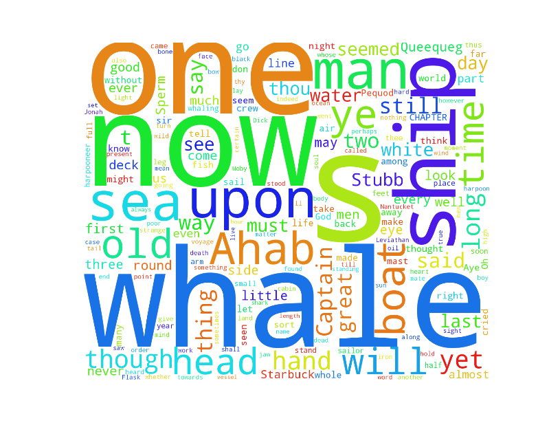

<h1>NLTKWordClouds<h1>

This is a simple project using NLTK and wordcloud to generate word clouds from texts included in NLTK. 
The texts used are:

<ul>
Moby Dick by Herman Melville

Sense and Sensibility by Jane Austen

The Book of Genesis

Inaugural Address Corpus

Chat Corpus

Monty Python and the Holy Grail

Wall Street Journal

Personals Corpus

The Man Who Was Thursday by G.K. Chesterton
<ul>

<h6>Moby Dick<h6>

    from IPython.display import Image
    Image(filename='figure_1.png')

<h6>Sense and Sensibility by Jane Austen<h6>

    from IPython.display import Image
    Image(filename='figure_2.png')

<h6>The Book of Genesis<h6>

    from IPython.display import Image
    Image(filename='figure_3.png')

<h6>Inaugural Address Corpus<h6>

    from IPython.display import Image
    Image(filename='figure_4.png')

<h6>Chat Corpus<h6>

    from IPython.display import Image
    Image(filename='figure_5.png')

<h6>Monty Python and the Holy Grail<h6>

    from IPython.display import Image
    Image(filename='figure_6.png')

<h6>Wall Street Journal<h6>

    from IPython.display import Image
    Image(filename='figure_7.png')

<h6>Personals Corpus<h6>

    from IPython.display import Image
    Image(filename='figure_8.png')

<h6>The Man Who Was Thursday by G.K. Chesterton<h6>

    from IPython.display import Image
    Image(filename='figure_9.png')

    
